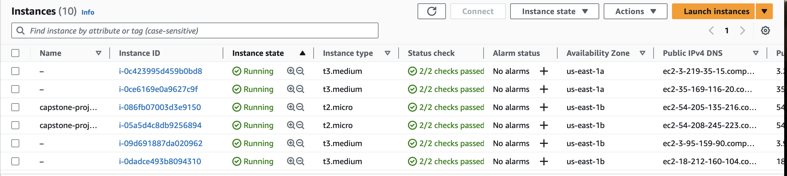
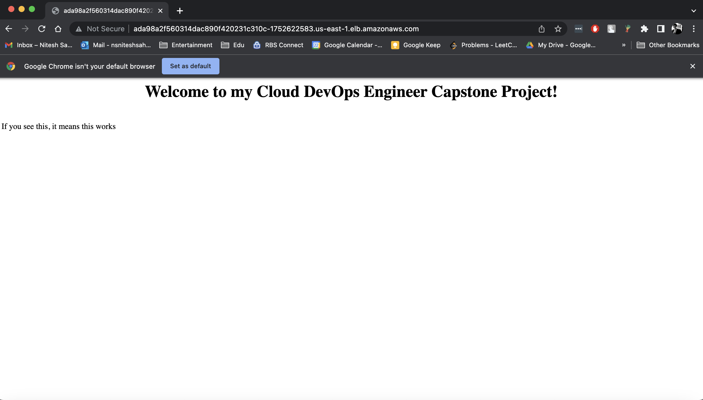

# Cloud DevOps Engineer Capstone Project

This project represents the successful completion of the last final Capstone project and the Cloud DevOps Engineer Nanodegree at Udacity.

## Application

The Application is based on a python3 script using <a target="_blank" href="https://flask.palletsprojects.com">flask</a> to render a simple webpage in the user's browser.
A requirements.txt is used to ensure that all needed dependencies come along with the Application.

## Kubernetes Cluster

I used AWS CloudFormation to deploy the Kubernetes Cluster.
The CloudFormation Deployment can be broken down into four Parts:
- **Networking**, to ensure new nodes can communicate with the Cluster
- **Elastic Kubernetes Service (EKS)** is used to create a Kubernetes Cluster
- **NodeGroup**, each NodeGroup has a set of rules to define how instances are operated and created for the EKS-Cluster
- **Management** is needed to configure and manage the Cluster and its deployments and services. I created two management hosts for extra redundancy if one of them fails.

#### List of deployed Stacks:


#### List of deployed Instances:


## CircleCi - CI/CD Pipelines

I used CircleCi to create a CI/CD Pipeline to test and deploy changes manually before they get deployed automatically to the Cluster using Ansible.

#### Project demonstration:


## Linting using Pylint and Hadolint

Linting is used to check if the Application and Dockerfile is syntactically correct.
This process makes sure that the code quality is always as good as possible.

#### This is the output when the step fails:


#### This is the output when the step passes:


## Access the Application

After the EKS-Cluster has been successfully configured using Ansible within the CI/CD Pipeline, I checked the deployment and service as follows:

```
$ kubectl get deployments
NAME                          READY   UP-TO-DATE   AVAILABLE   AGE
capstone-project-deployment   4/4     4            4           68m

$ kubectl get services
NAME                       TYPE           CLUSTER-IP       EXTERNAL-IP                                                                  PORT(S)        AGE
capstone-project-service   LoadBalancer   10.100.10.90   ada98a2f560314dac890f420231c310c-1752622583.us-east-1.elb.amazonaws.com   80:32299/TCP   69m
kubernetes                 ClusterIP      10.100.0.1       <none>                                                                       443/TCP        80m
```


Public LB DNS: http://ada98a2f560314dac890f420231c310c-1752622583.us-east-1.elb.amazonaws.com/



Github Repo URL: https://github.com/nsniteshsahni/cloud-dev-ops-engineer-capstone-project

Dockerhub Image URL: https://hub.docker.com/r/nsniteshsahni/capstone-project
